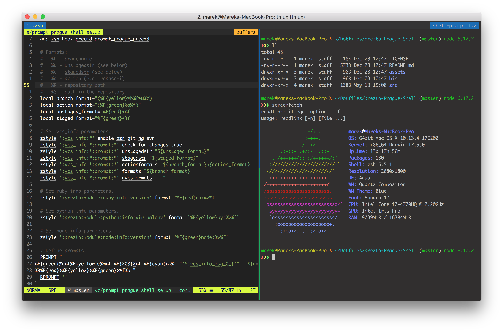

# prezto: Prague Shell
Theme for prezto and zsh and colors for iTerm2.app

Screenshot
==========


installation
============
Clone from git or add as submodule to your Dotfiles

```shell
$ git clone git@github.com:turboMaCk/prezto-Prague-Shell.git
# or
$ git submodule add git@github.com:turboMaCk/prezto-Prague-Shell.git
```

Create symlink in zprezto theme directory using install script

```shell
$ sh bin/install.sh
```

set Prague Shell as your theme in .zprestorc

```shell
zstyle ':prezto:module:prompt' theme 'prague_shell'
```
